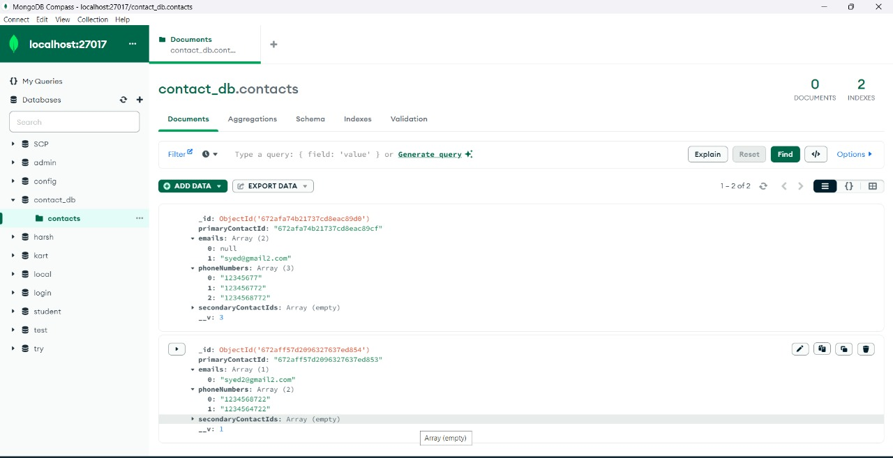

# EMotorad - Backend task

Here is a README file that explains the functionality, setup, and usage of the contact consolidation API.

Technologies Used
Express.js: Web framework for building the API server.
Node.js: JavaScript runtime for building the backend.
MongoDB: Database for storing and managing contact details.
Postman: Tool for testing the API endpoints

Features
Accepts JSON payloads with email and phoneNumber fields.
Consolidates contacts across multiple entries with matching information.
Maintains primary and secondary contacts with linkPrecedence.
Provides a response with consolidated contact information.
Error handling for seamless API operation.

Endpoints -
-- request bosy
-- response
-- status codes 

Below drive has screenshots of postman and mongodb -
  
  

Testing the API with postman - http://localhost:3000/contacts

COntact schema - 
- contact
  - primaryContactId
  - emails
  - phoneNumbers
  - linkPrecedence ( Indicates if a contact is primary or secondary ) 
  - secondaryContactIds
